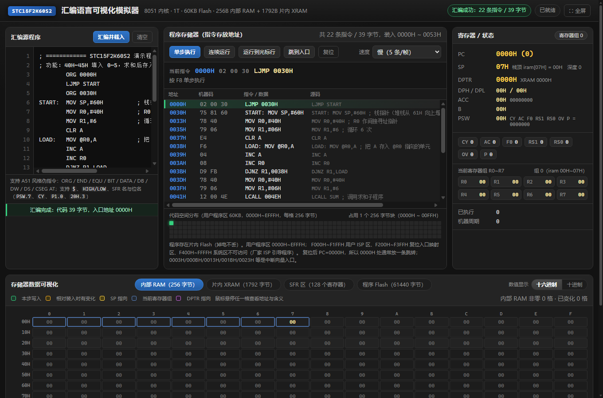

# STC15F2K60S2 汇编语言可视化模拟器 / Assembly Visual Simulator

**中文**（本文件） | [English summary](#english-summary) | [仓库首页 / Repository README](../README.md)



> **AI 声明 / AI disclosure**：本模拟器的全部代码、测试与文档均由 **AI 编码代理**（DeepSeek Harness 的
> deepseek-flash 代理）生成，人类负责提需求、评审与反馈缺陷；**未在实物芯片上对拍验证**，
> 手册中的冲突项已逐条标注为"未证实"。完整声明见仓库首页
> [AI 声明](../README.md#ai-声明) · [AI disclosure](../README.md#ai-disclosure)。
>
> *All code, tests and documentation were written by an AI coding agent. The simulator has **not** been
> validated against physical silicon. See the full disclosure in the [repository README](../README.md#ai-disclosure).*

---

## English summary

A browser-based, **instruction-level** simulator for the 8051 / STC15F2K60S2 microcontroller.
Write assembly, assemble it, and **step through it instruction by instruction** while the UI visualizes
where each instruction is stored, every byte of internal RAM / XRAM / SFR / program Flash, and the
PC / SP / DPTR / PSW registers.

- **Zero dependencies, no build step**: vanilla JS + HTML + CSS; Node is only used for the static server and tests.
  Open `index.html` directly, or run `node serve.mjs 8099`.
- **Full MCS-51 instruction set** (255 opcodes / 111 instructions), two-pass assembler with A51-style
  directives and expressions.
- **Byte-level memory visualization** with hover details (address, region, bit range, hex/dec/binary, ASCII,
  last write), change highlighting, and a hex/decimal display toggle.
- **Teaching-oriented diagnostics**: undefined symbols (including labels placed after `END`, and
  "did you mean…?" suggestions), the `80H~FFH` direct-vs-indirect trap, `MOVC`/`MOVX` confusion,
  illegal `@R2~@R7` indirect addressing, missing reset vector, etc.
- **Tests**: 54 unit checks + 153 browser integration checks; the opcode table is cross-checked against
  7 independent sources (lengths 256/256, cycles 256/256, mnemonics 256/256 — zero differences).
- **Not emulated (by design)**: timers, UART, ADC, PCA, watchdog, interrupt dispatch, EEPROM/IAP.

This file documents everything in detail in Chinese. The [repository README](../README.md#english) has the
full English version.

---

浏览器里运行的 8051 / STC15F2K60S2 **指令级**汇编模拟器：写汇编 → 汇编 → **逐条执行**，
实时可视化**指令存放地址**、**内部 RAM / XRAM / SFR 每个格子的数据变动**与 **PC / SP / DPTR / PSW** 等寄存器。

零依赖：不需要 Node 之外的任何东西，四个 JS 文件 + 一个 HTML 页面，纯原生实现（无框架、无构建步骤）。

---

## 一、怎么用

**方式 1（推荐）**：双击 `启动模拟器.cmd` → 自动打开 <http://127.0.0.1:8099/>

**方式 2**：命令行

```bash
cd stc15-sim
node serve.mjs 8099      # 或 npm start
```

**方式 3**：直接双击 `index.html`（也能用，脚本都是经典 `<script>`，不需要服务器）

### 界面操作

| 操作 | 快捷键 | 说明 |
|---|---|---|
| 汇编并载入 | `Ctrl+Enter` | 汇编左侧源码，成功后复位并载入代码 |
| 单步执行 | `F8` | **逐条执行一条指令**，所有视图同步刷新 |
| 连续运行 / 暂停 | `F5` | 速度可调（1 / 5 / 50 / 500 / 5000 条每帧） |
| 运行到光标行 | `F10` | 先在代码清单里点一行设置光标 |
| 跳到入口 | — | 把 PC 设到程序第一条指令（跳过 `0000H` 起、程序未占用的空片区域） |
| 复位 | `F9` | PC、SP、RAM、SFR 全部回到初值 |
| 网页全屏 / 退出 | `Ctrl+Shift+F` | 或点顶栏右上角「⛶ 全屏」按钮；按 `Esc` 也可退出 |

### 四个可视化区域

1. **汇编源程序**：编辑区 + 汇编错误/警告列表（带行号，点击清单可定位）。
2. **程序存储器（指令存放地址）**：每条指令的**存放地址**、机器码、反汇编文本、对应源码；
   当前 **PC 所在行高亮**（绿色），光标行紫色；下方 **代码空间分布图**（60KB Flash / 每格 256 字节）
   显示代码占用块与 PC 所在块。
3. **寄存器 / 状态**：PC、SP（含栈顶内容与深度）、**DPTR**（含 DPH/DPL 与 XRAM 指向）、ACC（含二进制）、B、
   PSW 与 7 个标志位灯、当前寄存器组的 R0~R7、已执行步数、机器周期数。
4. **存储器数据可视化**：
   - **内部 RAM（256 字节，16×16）**：每格显示十六进制值，**鼠标悬停显示该格子的地址**、所属区域
     （工作寄存器区 / 位寻址区 / 用户 RAM 区 / 间接寻址区）、位地址范围、十进制/二进制/ASCII 值、
     最近一次被写入的步数与数值变化。
   - **片内 XRAM（1792 字节，28×64）**：MOVX 访问的扩展 RAM。
   - **SFR 区（128 个寄存器）**：显示寄存器名与值，位可寻址的寄存器给出位地址范围与逐位当前值。
   - **程序 Flash（61440 字节）**：**分页逐字节查看**（256 字节/页，共 240 页），行标直接给出绝对地址。
     翻页按钮 /「跳到 PC 所在页」/ 输入地址跳转 /「跟随 PC」自动翻页；点上方**代码空间分布图的任一小块**
     可直接跳到对应页。格子上：亮色=已编程，暗灰 `FF`=擦除态，绿色文字=数据表（`DB`）字节，
     绿框=当前 PC 所在指令的全部字节。悬停显示**该字节的绝对地址、是否已编程、属于第几行源码、
     是操作码还是操作数、是否被 DPTR/PC 指向**。
   - **全片擦除 / 撤销**：「⨯ 全片擦除」模拟真实 ISP 的芯片擦除 —— 把**用户程序区 `0000H~EFFFH`
     全部 61440 字节写为 `FFH`**（`F000H` 以上的 ISP/系统区不动）。危险操作需**点两次确认**
     （首次点击按钮变为「再点一次确认擦除」，3 秒内不再点自动取消），擦除后可点「↺ 撤销擦除」原样恢复。
     擦除**不复位 PC**，继续单步会执行 `FFH`（即 `MOV R7,A`），与真机擦除后跑空片一致；
     源码仍留在编辑区，点「汇编并载入」即可重新烧写。

   **数值显示进制切换**：内存面板右上角「数值显示」可在**十六进制 / 十进制**之间切换，
   四张视图（内部 RAM / XRAM / SFR / Flash）同时生效；十进制统一补足 3 位（`000`~`255`）以便对齐，
   悬停提示里用 `▸` 标出当前进制，并始终同时给出两种进制与二进制。选择会被记住（localStorage）。

   颜色语义：<span>绿色边框</span>=本步刚被写入；<span>橙点</span>=相对装入时数值已变化；
   黄框=SP 指向的格子；蓝框=当前寄存器组；紫框=DPTR 指向的格子。

### 界面风格

- **编辑器带行号栏**：行号与正文同字号同行高（21px）严格对齐，纵向滚动同步；
  光标所在行号高亮（黄色）；源码增删行时行号自动重建。
- **清单列宽按内容实测**：4 列（地址 / 机器码 / 指令 / 源码）宽度由 JS 量出本程序中最长的那条内容后
  统一设定，表头与所有行共用同一套列宽（始终对齐）。源码列**不再用省略号截断**，整行文本完整渲染，
  超宽时靠**横向滚动条**查看；短程序不会出现多余的横向滚动条。
- **上面三栏等高对齐**：中间「程序存储器」栏含代码清单、内容最高，左右两栏（汇编源程序 / 寄存器）
  随之拉伸到同一高度；编辑器里的文本域是弹性子项，会吃掉多余高度，所以**三栏底边齐平且内部不留空白**。
- **两处高度上限**（可用 CSS 变量调整）：编辑器 `--ed-max-h`（默认 `32vh`，故意略小于代码栏以保证
  中间栏是最高的一栏）、代码清单 `--code-max-h`（默认 `30vh`）。程序再长也不会把下面的存储器可视化顶出屏幕，
  超出部分在各自区域内滚动；清单表头在横向滚动时跟随平移，保持列对齐。
- **滚动条统一为深色**：`color-scheme: dark` 让浏览器原生控件（下拉框、复选框、滚动条）进入深色模式，
  并用 `::-webkit-scrollbar` / `scrollbar-color` 统一滚动条外观；编辑器、清单、消息区、页面本身
  的滚动条轨道色各自跟随所在容器底色（编辑器 `#0f0f0f`、清单与消息区 `#1c1c1c`）。
  编辑器和代码清单都同时具备**横向与纵向**滚动条。
- 深灰主题（`#121212` 底 + 面板 `#1c1c1c`），只保留语义强调色：绿=本步写入、黄=SP/寄存器值、
  橙=数值变化、紫=DPTR/光标行、蓝=按钮/PC/地址等强调。
- 顶栏右上角「⛶ 全屏」按钮（`Ctrl+Shift+F`）可进入网页全屏。

### 出问题时不会“静默失败”

界面上的每个操作按钮都包了一层异常保护：任何**模拟器自身的异常**都会在消息区显示红色的
「内部错误」条目并把状态条变红，绝不再出现「点了没反应、也没有任何提示」这种无法诊断的情况；
未捕获的脚本错误也会自动显示到消息区。

另外三种容易误判为“坏了”的情况都有明确提示：

| 情况 | 现在的表现 |
|---|---|
| 编辑区为空就点载入 | 状态条「没有可载入的代码（0 字节）」+ 提示「编辑区是空的」 |
| 源码只有注释 / 标号 / 伪指令 | 状态条同样告警 + 提示「没有产生任何代码」 |
| 汇编失败 | 报错行 + 「本次汇编失败，未载入任何程序。程序存储器里仍是上一次成功载入的代码」 |
| PC 停在程序外的空片区 | 清单顶部橙色提示行 + 当前指令下方说明 + 「跳到入口」按钮 |
| **未定义符号**（找不到标号） | 报错里附上可定位的原因：<br>· 标号写在 `END` 之后 → 「该标号定义在第 N 行，但那一行在 END 之后，汇编已经停止 —— 请把 END 移到最后一行」（END 行同时警告「后面 N 行被忽略」）<br>· 拼写不一致 → 「是不是想写 “PTDS”？…定义在第 N 行」<br>· 源码里一个标号都没有 → 「当前源码里没有定义任何标号」 |

---

## 二、支持的汇编语法（A51 风格）

- **指令**：标准 MCS-51 全部 **255 个操作码**（111 条指令），STC15F2K60S2 与其指令代码完全兼容、无私有扩展操作码。
- **寻址方式**：立即数 `#30H`、直接地址 `30H` / SFR 名 `PSW`、寄存器 `R0~R7`、
  间接 `@R0` `@R1` `@DPTR`、变址 `@A+DPTR` `@A+PC`、位地址 `P1.0` `PSW.7` `CY` `20H.3` `2FH.7`。
- **伪指令**：`ORG` `END` `EQU` `=` `DATA` `BIT` `DB`/`DEFB` `DW`/`DEFW` `DS` `CSEG AT`；
  `SEGMENT`/`USING`/`PUBLIC`/`EXTRN`/`NAME` 等会被忽略并给出警告。
- **表达式**：`+ - * / MOD SHL SHR AND OR XOR NOT HIGH LOW`、括号、`'A'` 字符常量、`$`（当前指令地址）。
- **数制**：`123`、`0FFH`/`0xFF`、`1010B`、`123D`。
- **注释**：`;`
- 与 Keil A51 的差异：符号名**大小写不敏感**；不支持 `$INCLUDE`、宏、条件汇编 `IF/ELSE`、多模块链接；
  `AJMP/ACALL` 目标不在当前 2KB 页时按当前页低 11 位编码并给出警告。

---

## 三、模拟器的实现口径（重要）

- **存储器模型**：内部 RAM 256B（低 128B 直接/间接，高 128B **仅可间接**寻址）；
  直接地址 `80H~FFH` 一律指向 **SFR**，间接地址 `80H~FFH` 指向**高 128B RAM** —— 严格还原 8051 的经典重叠特性，两者互不影响。
- **SFR 数据**：86 个寄存器（已剔除本型号未引出的 P6/P7/T3/T4 等 12 个），位名与复位值取自官方手册核对后的数据表，
  由 `tools/gen-sfr-data.mjs` 从 `research/stc15f2k60s2-sfr.json` 生成，可复现。
- **位寻址**：`20H~2FH`（位地址 `00H~7FH`）+ 13 个位可寻址 SFR（`80H~FFH` 中地址能被 8 整除者）。
- **标志位**：`CY/AC/F0/RS1/RS0/OV/P` 按 8051 硬件规则更新（加减法进位/半进位/溢出、`DA A` 十进制调整、`MUL/DIV`、奇偶标志 P）。
- **堆栈**：SP 复位 `07H`；`LCALL/ACALL` 先压返回地址低字节再压高字节，`RET/RETI` 反向弹出。
- **未模拟（有意从简）**：定时器/串口/ADC/PCA/看门狗/EEPROM(IAP)/中断响应等**外设行为**。
  这些 SFR 可以读、可以写、值会正常显示与变化，但不会产生硬件动作；`RETI` 按 `RET` 处理。
  模拟器聚焦「**指令集 + 存储器 + 寄存器**」本身。
- **周期数**：按**标准 8051 机器周期**（12 时钟）统计，仅作相对参考。该列表已与
  Keil + Actel Core8051 + Atmel 4316E + Intel MCS-51 手册等 7 个来源逐条比对，256 条**全部一致**（`research/8051-opcodes.json`）。
  STC15F2K60S2 是 1T 内核（111 条指令共 283 个时钟 vs 传统 1944），未换算成 1T 时钟数。
- **未定义操作码**：`0A5H` 为保留操作码，执行时按单字节 NOP 处理并给出提示。

### 程序存在哪里（真实芯片 vs 模拟器）

真实 STC15F2K60S2 里，**程序（机器码）存在片内 Flash**，掉电不丢；RAM 只放运行时的数据。
8051 是**哈佛结构**：程序空间与数据空间**独立编址**，两者都从 `0000H` 开始却互不相干 ——
代码空间的 `00AAH` 与内部 RAM 的 `00AAH` 是两个完全不同的地方（这正是下面那条坑的根源）。

| 空间 | 真实芯片 | 本模拟器 |
|---|---|---|
| 用户程序区 | 片内 Flash `0000H~EFFFH`（60KB，掉电不丢） | 「程序存储器」面板 + 内部 64KB `rom` 数组 |
| ISP / 系统区 | `F000H~F1FFH` 用户 ISP 区、`F200H~F3FFH` 复位入口映射区、`F400H~FFFFH` 系统区（厂家 ISP 引导程序，不可访问） | 不模拟；汇编超过 `EFFFH` 会报「超出代码空间上限」 |
| 常量表（`DB`） | 同样存在 Flash 里，用 `MOVC A,@A+DPTR` 读 | 同左，`DB` 直接汇编进代码空间 |
| 运行时数据 | 内部 RAM 256B + AUX-RAM 1792B（掉电即丢） | RAM / XRAM 视图 |
| 可反复擦写的非易失区 | EEPROM/IAP 1KB（IAP 地址 `0000H~03FFH`，`MOVC` 读时 `F000H~F3FFH`） | 不模拟 IAP 时序 |

补充要点：

- 复位后 **PC = 0000H**（模拟器与真机一致），所以 `0000H` 处通常放一条跳转（`LJMP START`）；
  `0003H/000BH/0013H/001BH/0023H…` 是中断向量入口。**若 `0000H` 没有指令**，模拟器照真机行为先执行空片的
  `FFH`（`MOV R7,A` 之类的单字节指令）一路滑到你的代码，并在汇编时给出提示；此时清单第一条指令会自动成为
  光标行，按 `F10`「运行到光标行」即可直接跳到程序入口。**PC 落在程序之外时也不会“看起来没反应”**：
  清单顶部会置顶一条橙色提示行「◀ PC 在这里：程序之外的空片区域（FFH 即 MOV R7,A）」，
  当前指令下方给出同样说明，点「跳到入口」按钮可一键进入程序。
- 程序是**下载**进去的：用 STC-ISP 软件经串口/USB 做 **ISP 下载**（STC 不需要专用编程器）。
  芯片冷启动先跑系统区的厂家引导程序，握手成功后把 `.hex` 里的机器码写进 `0000H~EFFFH`。
- Flash **擦除态是 `FFH`**：模拟器里未编程的代码空间同样保持 `FFH`，所以 `MOVC` 读空区域得到 `FFH`，与硬件一致。
- `EFEEH~EFFFH`（用户区最后 14 字节）据手册是出厂校准参数区，用户能否覆盖手册未说明（**未证实**）。
- 片内数据空间还可外扩最多 64KB 数据存储器（`MOVX` 访问 `≥0700H` 时按片外处理）。

### MOVC 能用，但只有两种写法（查表专用）

`MOVC` 是完整支持的指令（`@A+DPTR` 编码 `93H`、`@A+PC` 编码 `83H`，均有测试覆盖）。
它**只能变址寻址**，合法写法就两种：

```asm
        MOV DPTR,#TAB        ; 表首地址送 DPTR
        MOV A,#2             ; A = 表内偏移
        MOVC A,@A+DPTR       ; ✓ A ← 代码空间 [DPTR + A] → 33H
        SJMP $
TAB:    DB 11H,22H,33H,44H
```

```asm
        MOV A,#2             ; ← 基址是「MOVC 下一条指令的地址」，不是 MOVC 自己的地址
        MOVC A,@A+PC         ; ✓
        SJMP NEXT
TAB:    DB 5AH,6BH
NEXT:   ...
```

写错时报错会直接给出可照抄的正确写法：

| 写法 | 结果 |
|---|---|
| `MOVC A,@A+DPTR` / `MOVC A,@A+PC` | ✅ 可用（也接受 `@DPTR+A` / `@PC+A` 写法） |
| `MOVC A,@DPTR` | ❌ 报错并提示：MOVC 只能变址寻址；按 DPTR 读数据要用 `MOVX A,@DPTR` |
| `MOVX A,@A+DPTR` | ❌ 报错并提示：MOVX 不带 `+A`，查表要用 `MOVC` |
| `MOVC A,@R0` / `MOVC A,#TAB` | ❌ 报错并说明只支持 `@A+DPTR` / `@A+PC` |
| `MOV @R2,A` | ❌ 报错并说明：8051 的间址寄存器**只有 R0/R1** |

两个实用细节：

- **单步执行 MOVC 时**，「当前指令」下方会写出实际算式，例如
  `查表：DPTR=0100H + A=07H → 读代码空间 0107H = 33H`，`@A+PC` 偏移算错能一眼看出。
- **越界查表**读到的是 `FFH`（Flash 擦除态，与真机一致），不是 `00H`。
- `MOVC` 只读**代码空间（Flash）**；读**数据存储器**（片内 XRAM / 片外）必须用 `MOVX`。

### ⚠ 最容易踩的坑：`MOV 0AAH,A` 改的是 SFR，不是 RAM

8051 里**直接寻址**的 `80H~FFH` 一律指向 **SFR**；内部 RAM 的高 128 字节（`80H~FFH`）**只能间接寻址**。
所以下面两段效果完全不同：

```asm
        MOV A,#03H
        ADD A,#05H
        MOV 0AAH,A          ; ✗ 实际写入 SFR WKTCL（低功耗唤醒定时器），内部 RAM 0AAH 不变
```

```asm
        MOV A,#03H
        ADD A,#05H
        MOV R0,#0AAH        ; ✓ 要写内部 RAM 0AAH 必须用间接寻址
        MOV @R0,A
```

模拟器会在三个地方主动说明：汇编时消息区给出**提示**（蓝色）；
单步执行到该指令时「当前指令」下方写明 `写入：SFR AAH WKTCL FFH→08H` 并附
「这是特殊功能寄存器，内部 RAM 同地址的格子不受影响」；在 RAM 格子（`80H~FFH`）上悬停也能看到同样说明。

---

## 四、正确性怎么验证的

```bash
node test/run-tests.mjs          # 54 项：汇编编码 + 指令语义 + 综合程序
node test/cross-check-opcodes.mjs # 与外部独立指令表逐条比对（长度/周期/助记符）
```

1. **255 个操作码全量回环**：程序化地为每个操作码构造汇编源码 → 汇编 → 比对机器码（含操作数编码顺序、
   `MOV direct,direct` 的 `85H 源 目的` 反序、`AJMP/ACALL` 的页号编码）。
2. **指令语义**：CY/AC/OV/P 边界值、`SUBB` 借位、`MUL/DIV/DA A`、移位、位操作、`JBC`、
   堆栈与 `LCALL/RET` 返回地址字节序、寄存器组切换、直接/间接 `80H` 重叠、`MOVX`、`MOVC`、
   `XCHD`、`CJNE`、`DJNZ`、`JMP @A+DPTR`。
3. **综合程序**：子程序求和（堆栈 + 间接寻址 + MOVC 载入）、冒泡排序（CJNE + 间接交换）、
   双重 DJNZ 延时循环（含精确步数核对）。
4. **与独立来源交叉校验**：本项目的 256 项「操作码 → 长度 + 机器周期 + 助记符」表与两张外部权威表
   （[`8051Enthusiast/at51`](https://github.com/8051Enthusiast/at51)（MIT）长度表、
   `research/8051-opcodes.json`（Keil/Actel/Atmel/Intel 等 7 源交叉比对，含周期数））
   **长度 256/256、机器周期 256/256、助记符 256/256 全部一致，0 处差异**。
5. **真实浏览器集成自测**（153 项）：用无头 Edge 通过 DOM 事件驱动界面，检查清单渲染、256/1792/128 个格子、
   PC 高亮、SP 标记、写入高亮、变化标记、寄存器读数、标签切换、悬停提示内容、错误路径，
   以及**页面滚动可达性**（内存面板不被裁切、滚到底能看到 F0H 行）。

```bash
node test/run-tests.mjs    # 期望输出：通过 54 项，失败 0 项
```

---

## 五、目录结构

```
stc15-sim/
├── index.html                  界面结构
├── css/style.css               样式（深灰主题）
├── js/
│   ├── opcodes.js              255 个操作码指令表 + 反汇编格式化
│   ├── sfr-data.js             SFR / 位地址 / 存储器映射（由 tools 生成，勿手改）
│   ├── chips.js                SFR 索引、地址描述（悬停提示文案）
│   ├── assembler.js            两遍汇编器（伪指令、表达式、错误定位）
│   ├── cpu.js                  CPU 内核（逐条执行 + 写入追踪）
│   └── app.js                  界面逻辑与可视化
├── test/
│   ├── run-tests.mjs           54 项自动化测试
│   ├── cross-check-opcodes.mjs 与外部指令表交叉校验
│   ├── ui-selftest.html        浏览器集成自测页（153 项）
│   ├── ui-shot.html            截图辅助页
│   └── run-ui-test.cmd         一键跑自测 + 截图（需先启动 serve.mjs）
├── tools/gen-sfr-data.mjs      由权威 JSON 生成 js/sfr-data.js
├── serve.mjs                   零依赖静态服务器
└── 启动模拟器.cmd              双击即用
```

## 六、数据来源

- `../research/stc15f2k60s2-sfr.json` / `stc15f2k60s2-memory.md`：STC15F2K60S2 官方手册
  （`research/raw/STC15F2K60S2-cn.pdf`）+ 三处 GitHub 头文件镜像交叉核对得到的 98 个 SFR / 108 个 sbit、
  存储器映射与复位值（含 8 条未证实项说明）。
- `../research/existing-8051-web-simulators.md`：19 个现成 8051 Web 模拟器的调研（架构、许可证、可复用性）。
- 参考项目 [MentzJ/8051_simulator](https://github.com/MentzJ/8051_simulator)（Unlicense）用于架构选型对照，
  本项目为自研实现；[at51](https://github.com/8051Enthusiast/at51) 的指令长度表用于交叉校验。

## 七、已知限制

- 不模拟外设与中断（见上文口径），因此「定时器中断闪烁」这类程序只能看到寄存器数值变化。
- 周期数按标准 8051 机器周期统计，非 STC15 的 1T 时钟数。
- 不支持 `$INCLUDE`、宏、条件汇编、多模块链接；不支持 Intel HEX 导入/导出。
- 断点仅提供「运行到光标行」这一种形式。

## 八、AI 声明 / AI Disclosure

**中文**

本模拟器的**全部代码、测试与文档均由 AI 编码代理生成**（DeepSeek Harness 的 deepseek-flash 代理），
人类负责提出需求、审查结果并依据实际使用反馈推动修复。要点：

1. **代码**：CPU 内核、两遍汇编器、Web 界面、测试脚本与文档均为 AI 编写。人类贡献了多条关键缺陷报告，
   例如「只写标号不写指令的行被判为非法指令」、「点载入既不报错也没反应」（内部索引失效使点击处理器
   中途抛异常）、源码列被省略号截断等。
2. **芯片数据**：SFR / 位地址 / 256 条指令表由 AI 从公开资料整理（STC 官方手册、GitHub 头文件镜像、
   Keil / Actel / Atmel / Intel 手册等 7 个来源）并脚本化交叉校验，校验结果 256/256 一致。
3. **未在实物芯片上验证**：语义依据文档与参考表实现，由 54 项单元测试 + 153 项浏览器自测覆盖，
   **没有与实物 STC15F2K60S2 对拍**。手册冲突项（IE2 位分配、PSW 复位值、XRAM `0700H` 分界、
   用户区最后 14 字节归属等）已在 `../research/stc15f2k60s2-memory.md` 中标注为"未证实"。
   用于课程作业、产品设计或硬件调试时，请以官方手册与实物测试为准。
4. **外设有意未实现**（见「已知限制」）。
5. **AI 下载的第三方资料**中含无许可证或 GPL 项目，**均未入库**（见 `../.gitignore`）。
6. **不提供任何担保**，项目按「现状」提供。

**English**

Every line of code, every test and this documentation were generated by an **AI coding agent**
(the deepseek-flash agent of DeepSeek Harness); the human set the requirements, reviewed the output and
drove fixes from real use. In short: (1) the CPU core, two-pass assembler, web UI, tests and docs are
AI-written, with several critical bugs found by human testing; (2) the SFR / bit-address / 256-opcode
tables were compiled by the AI from public sources and cross-checked by scripts (256/256 agreement);
(3) the simulator has **never been validated against physical silicon** — manual conflicts are flagged as
unverified in `../research/stc15f2k60s2-memory.md`; (4) peripherals are intentionally not emulated;
(5) third-party material downloaded for cross-checking (including unlicensed and GPL projects) is excluded
from the repository; (6) the project is provided **as is, without warranty**.

完整声明见仓库首页：[AI 声明](../README.md#ai-声明) · [AI disclosure](../README.md#ai-disclosure)

## 九、许可证

本项目采用 **MIT 许可证**，详见仓库根目录 [`LICENSE`](../LICENSE)。可自由使用、修改、分发（含商用），
只需保留版权声明与许可证原文。软件按「现状」提供、不附带任何担保；本项目由 AI 生成且
**未在实物芯片上验证**（见第八节 AI 声明），正式使用前请自行复核。

*Released under the MIT License — see [`LICENSE`](../LICENSE).*
